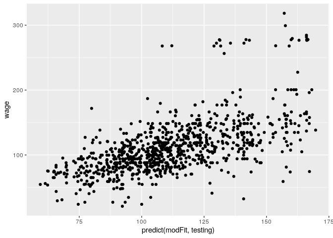

Boosting
================

## Setup

``` r
library(ggplot2)
library(caret)
```

    ## Loading required package: lattice

``` r
library(ISLR)
data(Wage)
```

## Subsets

``` r
Wage <- subset(Wage, select = -c(logwage))
inTrain <- createDataPartition(Wage$wage, p = 0.7, list = FALSE)
training <- Wage[inTrain,]
testing <- Wage[-inTrain,]
```

## Boosters

gbm - Boosting with trees

mboost - model based

ada - statistical boosting on additive logistic regression

gamBoost - boosting generalized additive
models

## Fit the Model

``` r
modFit <- train(wage ~ ., method = "gbm", data = training, verbose = FALSE)
modFit
```

    ## Stochastic Gradient Boosting 
    ## 
    ## 2102 samples
    ##    9 predictor
    ## 
    ## No pre-processing
    ## Resampling: Bootstrapped (25 reps) 
    ## Summary of sample sizes: 2102, 2102, 2102, 2102, 2102, 2102, ... 
    ## Resampling results across tuning parameters:
    ## 
    ##   interaction.depth  n.trees  RMSE      Rsquared   MAE     
    ##   1                   50      34.71939  0.3022701  23.56719
    ##   1                  100      34.18753  0.3119692  23.16210
    ##   1                  150      34.12367  0.3136210  23.15786
    ##   2                   50      34.18790  0.3133589  23.13150
    ##   2                  100      34.04110  0.3171077  23.08766
    ##   2                  150      34.11190  0.3149836  23.17903
    ##   3                   50      34.18326  0.3120329  23.11314
    ##   3                  100      34.21769  0.3105840  23.23022
    ##   3                  150      34.39649  0.3051723  23.37143
    ## 
    ## Tuning parameter 'shrinkage' was held constant at a value of 0.1
    ## 
    ## Tuning parameter 'n.minobsinnode' was held constant at a value of 10
    ## RMSE was used to select the optimal model using the smallest value.
    ## The final values used for the model were n.trees = 100, interaction.depth =
    ##  2, shrinkage = 0.1 and n.minobsinnode = 10.

``` r
qplot(predict(modFit, testing), wage, data = testing)
```

<!-- -->
