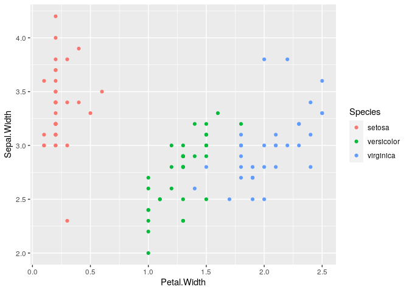
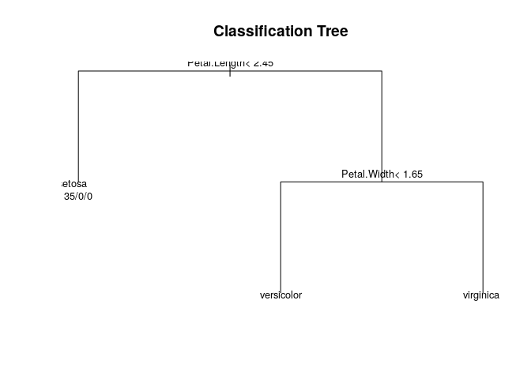

Classification Trees
================

## Setup

``` r
data(iris)
library(ggplot2)
library(caret)
```

    ## Loading required package: lattice

``` r
table(iris$Species)
```

    ## 
    ##     setosa versicolor  virginica 
    ##         50         50         50

## Subsets

``` r
inTrain <- createDataPartition(iris$Species, p = 0.7, list = FALSE)
training <- iris[inTrain,]
testing <- iris[-inTrain,]
```

## EDA

``` r
ggplot(training, aes(Petal.Width, Sepal.Width, color = Species)) + geom_point()
```

<!-- -->

## Fitting the Model

``` r
modFit <- train(Species ~ ., method = "rpart", data = training)
modFit$finalModel
```

    ## n= 105 
    ## 
    ## node), split, n, loss, yval, (yprob)
    ##       * denotes terminal node
    ## 
    ## 1) root 105 70 setosa (0.33333333 0.33333333 0.33333333)  
    ##   2) Petal.Length< 2.45 35  0 setosa (1.00000000 0.00000000 0.00000000) *
    ##   3) Petal.Length>=2.45 70 35 versicolor (0.00000000 0.50000000 0.50000000)  
    ##     6) Petal.Width< 1.65 36  2 versicolor (0.00000000 0.94444444 0.05555556) *
    ##     7) Petal.Width>=1.65 34  1 virginica (0.00000000 0.02941176 0.97058824) *

### Plotting the Classification Tree

``` r
plot(modFit$finalModel, uniform = TRUE, main = "Classification Tree")
text(modFit$finalModel, use.n = TRUE, cex = .8)
```

<!-- -->

``` r
# library(rattle)
# fancyRpartPlot(modFit$finalModel)
```

# Predicting new values

``` r
predict(modFit, newdata = testing)
```

    ##  [1] setosa     setosa     setosa     setosa     setosa     setosa    
    ##  [7] setosa     setosa     setosa     setosa     setosa     setosa    
    ## [13] setosa     setosa     setosa     versicolor versicolor versicolor
    ## [19] versicolor versicolor versicolor versicolor virginica  versicolor
    ## [25] versicolor versicolor versicolor versicolor versicolor versicolor
    ## [31] virginica  virginica  virginica  virginica  virginica  versicolor
    ## [37] virginica  virginica  virginica  virginica  versicolor virginica 
    ## [43] virginica  virginica  virginica 
    ## Levels: setosa versicolor virginica
