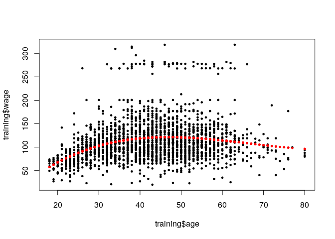

Covariate: Add Dummy | Polynomial, Rm Near Zero
================

## Setup

``` r
library(caret)
```

    ## Loading required package: lattice

    ## Loading required package: ggplot2

``` r
library(ISLR)
data(Wage)
```

``` r
inTrain <- createDataPartition(y = Wage$wage, p = 0.7, list = FALSE)
training <- Wage[inTrain,]
testing <- Wage[-inTrain,]
```

## Common covariates to add dummy variables

Basic idea is to convert factor variables to indicator variables

``` r
table(training$jobclass)
```

    ## 
    ##  1. Industrial 2. Information 
    ##           1065           1037

``` r
dummies <- dummyVars(wage ~ jobclass, data = training)
head(predict(dummies, newdata = training))
```

    ##        jobclass.1. Industrial jobclass.2. Information
    ## 161300                      1                       0
    ## 155159                      0                       1
    ## 11443                       0                       1
    ## 376662                      0                       1
    ## 450601                      1                       0
    ## 377954                      0                       1

## Removing near zero covariates

Removing less meaningful predictors who should not be used in a
prediction model

``` r
nsv <- nearZeroVar(training, saveMetrics = TRUE)
nsv
```

    ##            freqRatio percentUnique zeroVar   nzv
    ## year        1.101190    0.33301618   FALSE FALSE
    ## age         1.000000    2.90199810   FALSE FALSE
    ## maritl      3.360920    0.23786870   FALSE FALSE
    ## race        8.698020    0.19029496   FALSE FALSE
    ## education   1.480349    0.23786870   FALSE FALSE
    ## region      0.000000    0.04757374    TRUE  TRUE
    ## jobclass    1.027001    0.09514748   FALSE FALSE
    ## health      2.562712    0.09514748   FALSE FALSE
    ## health_ins  2.336508    0.09514748   FALSE FALSE
    ## logwage     1.073171   19.50523311   FALSE FALSE
    ## wage        1.073171   19.50523311   FALSE FALSE

## Spline Basis

### Creating a polynomial model

``` r
library(splines)
bsBasis <- bs(training$age, df = 3)
head(bsBasis)
```

    ##              1         2           3
    ## [1,] 0.4163380 0.3211750 0.082587862
    ## [2,] 0.4308138 0.2910904 0.065560908
    ## [3,] 0.3625256 0.3866940 0.137491189
    ## [4,] 0.3063341 0.4241549 0.195763821
    ## [5,] 0.4241549 0.3063341 0.073747105
    ## [6,] 0.3776308 0.0906314 0.007250512

### Fitting model to train set

``` r
lm1 <- lm(wage ~ bsBasis, data = training)
plot(training$age, training$wage, pch = 19, cex = 0.5)
points(training$age, predict(lm1, newdata = training), col = "red", pch = 19, cex = 0.5)
```

<!-- -->

### Fitting model to test set

``` r
aux <- predict(bsBasis, age = testing$age)
head(aux)
```

    ##              1         2           3
    ## [1,] 0.4163380 0.3211750 0.082587862
    ## [2,] 0.4308138 0.2910904 0.065560908
    ## [3,] 0.3625256 0.3866940 0.137491189
    ## [4,] 0.3063341 0.4241549 0.195763821
    ## [5,] 0.4241549 0.3063341 0.073747105
    ## [6,] 0.3776308 0.0906314 0.007250512

Key search in Google: feature extraction for \[data type\]
