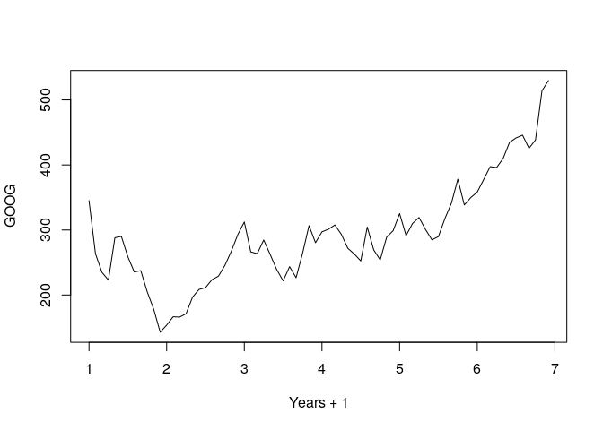
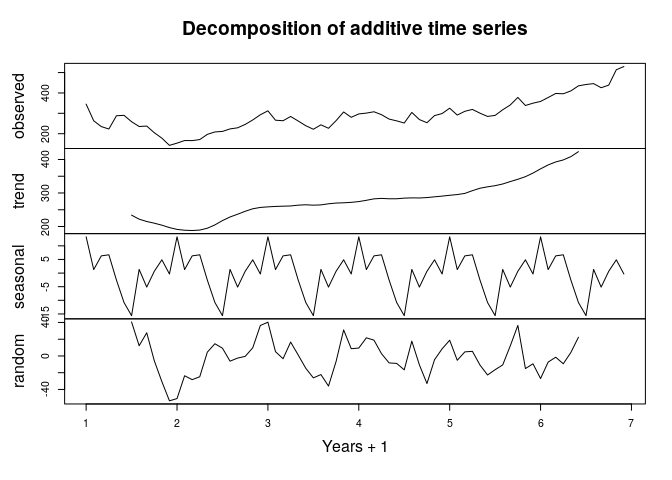
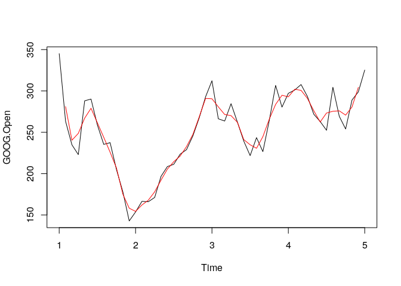
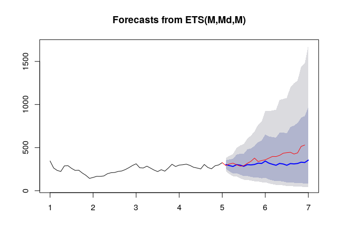

Forecasting
================

## Setup

``` r
library(quantmod)
library(caret)
library(forecast)
library(dplyr)
library(ggplot2)
```

## Collect Data

``` r
from.dat <- as.Date("01/01/08", format = "%m/%d/%y")
to.dat <- as.Date("12/31/13", format = "%m/%d/%y")
getSymbols("GOOG", src = "yahoo", from = from.dat, to = to.dat)
```

    ## 'getSymbols' currently uses auto.assign=TRUE by default, but will
    ## use auto.assign=FALSE in 0.5-0. You will still be able to use
    ## 'loadSymbols' to automatically load data. getOption("getSymbols.env")
    ## and getOption("getSymbols.auto.assign") will still be checked for
    ## alternate defaults.
    ## 
    ## This message is shown once per session and may be disabled by setting 
    ## options("getSymbols.warning4.0"=FALSE). See ?getSymbols for details.

    ## [1] "GOOG"

## EDA

``` r
monthGoog <- to.monthly(GOOG)
googOpen <- Op(monthGoog)
ts1 <- ts(googOpen, frequency = 12)
plot(ts1, xlab = "Years + 1", ylab = "GOOG")
```

<!-- -->

``` r
plot(decompose(ts1), xlab = "Years + 1")
```

<!-- -->

## Subsets

``` r
ts1Train <- window(ts1, start = 1, end = 5)
ts1Test <- window(ts1, start = 5, end = (7 - 0.01))
```

    ## Warning in window.default(x, ...): 'end' value not changed

``` r
ts1Train
```

    ##        Jan      Feb      Mar      Apr      May      Jun      Jul      Aug
    ## 1 345.1413 263.3479 234.8746 223.0340 288.0752 290.1624 258.8199 235.3728
    ## 2 153.7238 166.5208 166.0426 171.2481 196.7774 208.5832 211.3080 223.5322
    ## 3 312.3044 266.3018 263.6119 284.6082 262.2670 239.3180 221.8136 243.5820
    ## 4 297.1263 301.1163 307.7365 293.2807 271.8311 263.0341 252.4239 304.4688
    ## 5 325.2509                                                               
    ##        Sep      Oct      Nov      Dec
    ## 1 237.4948 204.8073 178.1224 142.8047
    ## 2 228.9817 245.5795 267.5372 292.9669
    ## 3 226.6405 264.0104 306.7154 280.4488
    ## 4 269.3654 253.9731 288.9669 298.8797
    ## 5

## Moving Average

``` r
plot(ts1Train)
lines(ma(ts1Train, order = 3), col = "red")
```

<!-- -->

## Exponential Smoothing

``` r
ets1 <- ets(ts1Train, model = "MMM")
fcast <- forecast(ets1)
plot(fcast)
lines(ts1Test, col = "red")
```

<!-- -->

## Get Model Accuracy

``` r
accuracy(fcast, ts1Test)
```

    ##                      ME     RMSE      MAE        MPE      MAPE      MASE
    ## Training set  0.2000302 26.09189 20.65928 -0.3572633  8.302526 0.3933832
    ## Test set     69.8911746 93.08104 72.04076 16.2879469 17.032408 1.3717625
    ##                       ACF1 Theil's U
    ## Training set -0.0002846501        NA
    ## Test set      0.7575349604  3.375609
