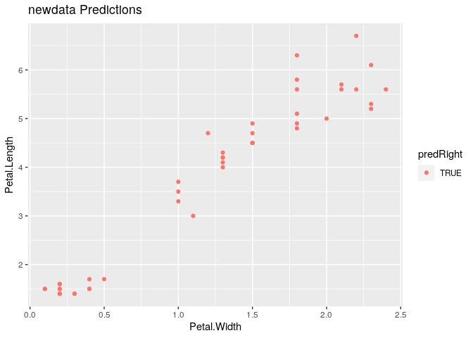

Model Based Prediction
================

## Setup

``` r
library(ggplot2)
library(caret)
```

    ## Loading required package: lattice

``` r
data(iris)
```

``` r
table(iris$Species)
```

    ## 
    ##     setosa versicolor  virginica 
    ##         50         50         50

## Subsets

``` r
inTrain <- createDataPartition(iris$Species, p = 0.7, list = FALSE)
training <- iris[inTrain,]
testing <- iris[-inTrain,]
```

## LDA Model

``` r
modLDA <- train(Species ~ ., data = training, method = "lda") # Linear Discriminant
# modNB <-  train(Species ~ ., data = training, method = "nb")
plda <-  predict(modLDA, testing)
# pnb = predict(modNB, testing)
# table(plda, pnb)
```

Comparison of results

``` r
# equalPredictions = (plda == pnb)
testing$predRight <- plda == testing$Species
table(plda, testing$Species)
```

    ##             
    ## plda         setosa versicolor virginica
    ##   setosa         15          0         0
    ##   versicolor      0         15         0
    ##   virginica       0          0        15

``` r
qplot(Petal.Width, Petal.Length, color = predRight, data = testing, main = "newdata Predictions")
```

<!-- -->
