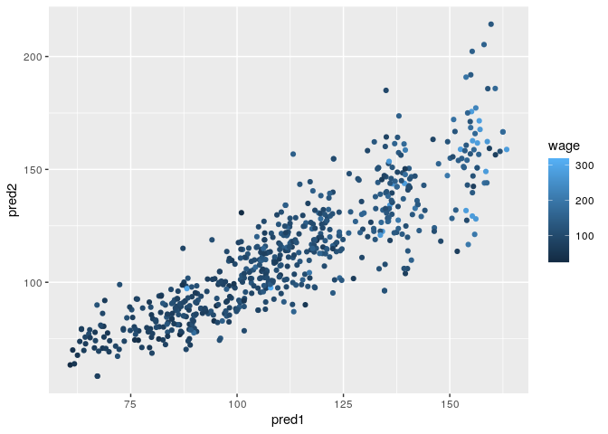

Model Stacking
================

## Setup

``` r
library(caret)
library(ISLR)
data(Wage)
```

## Subsets

``` r
Wage <- subset(Wage, select = -c(logwage))
inBuild <- createDataPartition(Wage$wage, p = 0.7, list = FALSE)
# Validation set
validation <- Wage[-inBuild,]

buildData <- Wage[inBuild,]
inTrain <- createDataPartition(buildData$wage, p = 0.7, list = FALSE)
# Training set
training <- buildData[inTrain,]
# Testing set
testing <- buildData[-inTrain,]
```

### Check dimensions

``` r
dim(training)
```

    ## [1] 1474   10

``` r
dim(testing)
```

    ## [1] 628  10

``` r
dim(validation)
```

    ## [1] 898  10

## Build Two Models

``` r
set.seed(42)
mod1 <- train(wage ~ ., method ="glm", data = training) # Generalized Linear Model
mod2 <- train(wage ~ ., method = "rf", data = training, trControl = trainControl(method = "cv"), number = 3) # Random Forest
```

## Plot Predictions Spread

``` r
pred1 <- predict(mod1, testing)
```

    ## Warning in predict.lm(object, newdata, se.fit, scale = 1, type = if (type == :
    ## prediction from a rank-deficient fit may be misleading

``` r
pred2 <- predict(mod2, testing)

ggplot(testing, aes(pred1, pred2, colour = wage)) + geom_point()
```

<!-- -->

## Fit a Model Combining Predictors

``` r
predDF <- data.frame(pred1, pred2, wage = testing$wage)
combModFit <- train(wage ~ ., method = "gam", data = predDF) # Generalized Additive Model
combPred <- predict(combModFit, predDF)
```

## Testing Sum of Squares Error

### Model 1 (glm)

``` r
sqrt(sum((pred1 - testing$wage)^2))
```

    ## [1] 902.6271

### Model 2 (rf)

``` r
sqrt(sum((pred2 - testing$wage)^2))
```

    ## [1] 947.7374

### Stacked Models (gam)

``` r
sqrt(sum((combPred - testing$wage)^2))
```

    ## [1] 881.701

## Predict on Validation Data Set

### Prediction of Individual Models

``` r
pred1V <- predict(mod1, validation)
pred2V <- predict(mod2, validation)
```

### Prediction of Combined Models

``` r
# Combine models
predVDF <- data.frame(pred1 = pred1V, pred2 = pred2V)
# Predict
combPredV <- predict(combModFit, predVDF)
```

## Validation Sum of Squares Error

### Model 1 (glm)

``` r
sqrt(sum((pred1V - validation$wage)^2))
```

    ## [1] 972.0055

### Model 2 (rf)

``` r
sqrt(sum((pred2V - validation$wage)^2))
```

    ## [1] 1011.905

### Stacked Models (gam)

``` r
sqrt(sum((combPredV - validation$wage)^2))
```

    ## [1] 970.1506

Tip: use caretEnsemble to combine models
