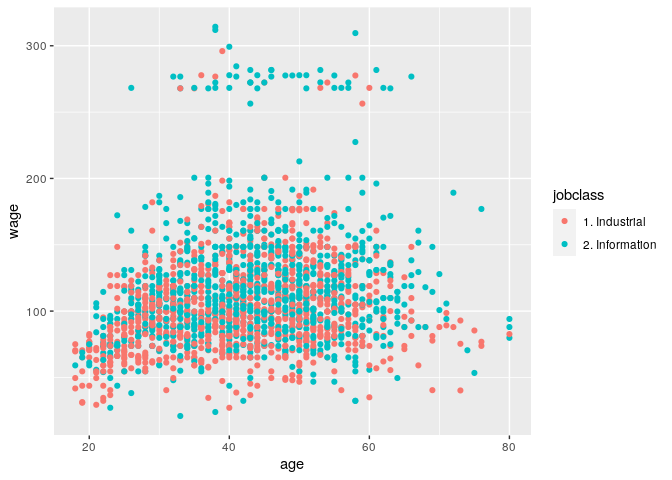

Multiple Covariates Linear Regression
================

## Setup

``` r
library(ISLR)
library(caret)
```

    ## Loading required package: lattice

    ## Loading required package: ggplot2

``` r
library(ggplot2)
data(Wage)

Wage <- subset(Wage, select = -c(logwage))

summary(Wage)
```

    ##       year           age                     maritl           race     
    ##  Min.   :2003   Min.   :18.00   1. Never Married: 648   1. White:2480  
    ##  1st Qu.:2004   1st Qu.:33.75   2. Married      :2074   2. Black: 293  
    ##  Median :2006   Median :42.00   3. Widowed      :  19   3. Asian: 190  
    ##  Mean   :2006   Mean   :42.41   4. Divorced     : 204   4. Other:  37  
    ##  3rd Qu.:2008   3rd Qu.:51.00   5. Separated    :  55                  
    ##  Max.   :2009   Max.   :80.00                                          
    ##                                                                        
    ##               education                     region               jobclass   
    ##  1. < HS Grad      :268   2. Middle Atlantic   :3000   1. Industrial :1544  
    ##  2. HS Grad        :971   1. New England       :   0   2. Information:1456  
    ##  3. Some College   :650   3. East North Central:   0                        
    ##  4. College Grad   :685   4. West North Central:   0                        
    ##  5. Advanced Degree:426   5. South Atlantic    :   0                        
    ##                           6. East South Central:   0                        
    ##                           (Other)              :   0                        
    ##             health      health_ins        wage       
    ##  1. <=Good     : 858   1. Yes:2083   Min.   : 20.09  
    ##  2. >=Very Good:2142   2. No : 917   1st Qu.: 85.38  
    ##                                      Median :104.92  
    ##                                      Mean   :111.70  
    ##                                      3rd Qu.:128.68  
    ##                                      Max.   :318.34  
    ## 

## Subsets

``` r
inTrain <- createDataPartition(y = Wage$wage, p = 0.7, list = FALSE)
training <- Wage[inTrain,]
testing <- Wage[-inTrain,]

dim(training)
```

    ## [1] 2102   10

``` r
dim(testing)
```

    ## [1] 898  10

## EDA

### Feature Plot

``` r
featurePlot(
    x = training[, c("age", "education", "jobclass")], 
    y = training$wage, 
    plot = "pairs"
)
```

<!-- -->

### Quick Plots

``` r
qplot(age, wage, color = jobclass, data = training)
```

<!-- -->

``` r
qplot(age, wage, color = education, data = training)
```

<!-- -->

``` r
modFit <- train(wage ~ age + jobclass + education, method = "lm", data = training)

print(modFit)
```

    ## Linear Regression 
    ## 
    ## 2102 samples
    ##    3 predictor
    ## 
    ## No pre-processing
    ## Resampling: Bootstrapped (25 reps) 
    ## Summary of sample sizes: 2102, 2102, 2102, 2102, 2102, 2102, ... 
    ## Resampling results:
    ## 
    ##   RMSE      Rsquared   MAE     
    ##   35.83458  0.2573814  24.80573
    ## 
    ## Tuning parameter 'intercept' was held constant at a value of TRUE

``` r
finMod <- modFit$finalModel

plot(finMod, 1, pch = 19, cex = 0.5, col="#00000010")
```

<!-- -->

## Plot Fitted Model x Residuals to preview Trends

Color by variables not used in the model

``` r
qplot(finMod$fitted, finMod$residuals, color = race, data = training)
```

<!-- -->

### Plot by Index

``` r
plot(finMod$residuals, pch = 19)
```

<!-- -->

## Predicted x Truth in Test Set

Obs: This is not to be used during training\!\! (it’s a post-test
analysis)

``` r
pred <- predict(modFit, testing)
qplot(wage, pred, color = year, data = testing)
```

<!-- -->

## Trying to use all Covariates

``` r
modFitAll <- train(wage ~ ., data = training, method = "lm")
pred <- predict(modFitAll, testing)
qplot(wage, pred, data = testing)
```

<!-- -->
