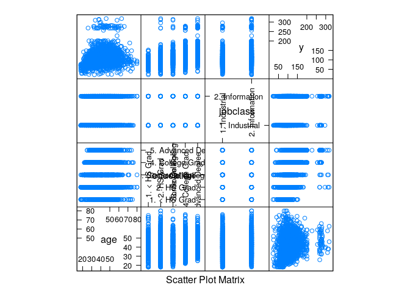
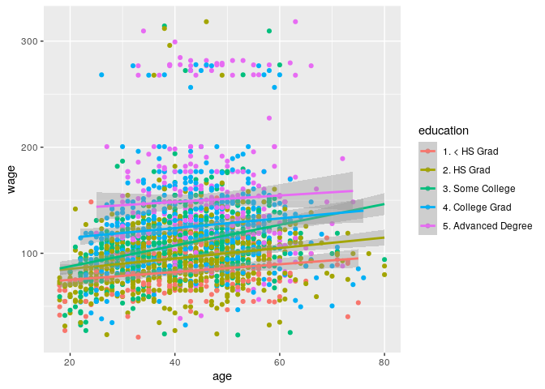
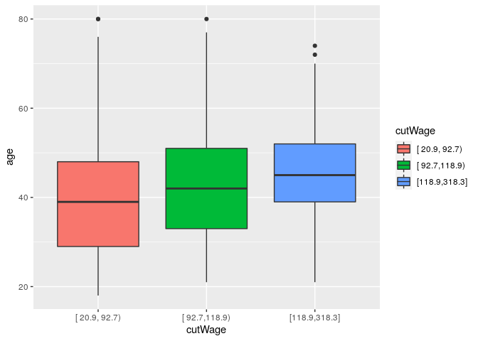
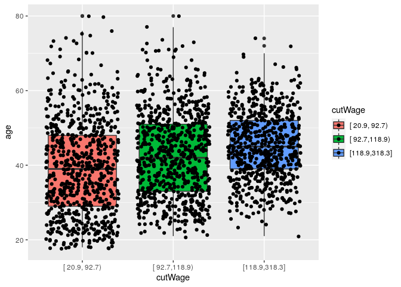
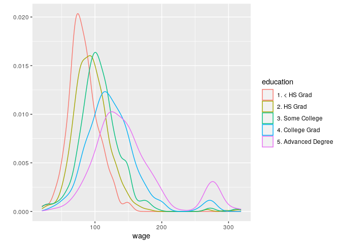

Plotting Predictors
================

## Setup

``` r
library(caret)
library(ISLR)
library(ggplot2)
library(Hmisc)
data(Wage)
```

## Subset

``` r
inTrain <- createDataPartition(y = Wage$wage, p = 0.7, list = FALSE)

training <- Wage[inTrain,]
testing <- Wage[-inTrain,]
```

## Feature Plot

``` r
featurePlot(
    x = training[, c("age", "education", "jobclass")], 
    y = training$wage, 
    plot = "pairs"
)
```

<!-- -->

``` r
qplot(age, wage, data = training, colour = education) +
    geom_smooth(method = 'lm', formula = y ~ x)
```

<!-- -->

## Break Multiple Quantiles

``` r
cutWage <- cut2(training$wage, g = 3) # Break into 3 quantile groups
table(cutWage)
```

    ## cutWage
    ## [ 20.9, 92.7) [ 92.7,118.9) [118.9,318.3] 
    ##           702           734           666

``` r
p1 <- qplot(cutWage, age, data = training, fill = cutWage, geom = "boxplot")
p2 <- qplot(cutWage, age, data = training, fill = cutWage, geom = c("boxplot", "jitter"))

p1
```

<!-- -->

``` r
p2
```

<!-- -->

## Table Analysis

``` r
t1 <- table(cutWage, training$jobclass)

t1
```

    ##                
    ## cutWage         1. Industrial 2. Information
    ##   [ 20.9, 92.7)           441            261
    ##   [ 92.7,118.9)           381            353
    ##   [118.9,318.3]           270            396

``` r
prop.table(t1, 1)
```

    ##                
    ## cutWage         1. Industrial 2. Information
    ##   [ 20.9, 92.7)     0.6282051      0.3717949
    ##   [ 92.7,118.9)     0.5190736      0.4809264
    ##   [118.9,318.3]     0.4054054      0.5945946

## Density Plot

``` r
qplot(wage, colour = education, data = training, geom = "density")
```

<!-- -->
