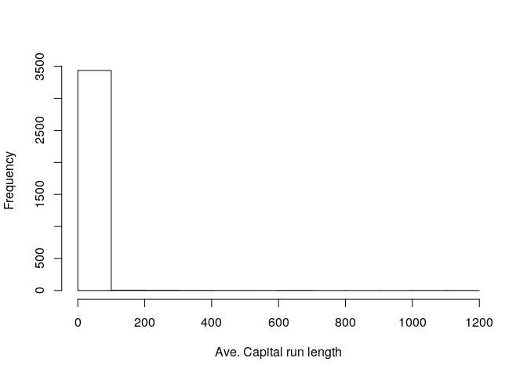
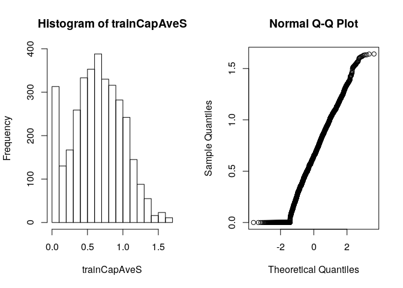

Preprocessing
================

## Setup

``` r
library(caret)
```

    ## Loading required package: lattice

    ## Loading required package: ggplot2

``` r
library(kernlab)
```

    ## 
    ## Attaching package: 'kernlab'

    ## The following object is masked from 'package:ggplot2':
    ## 
    ##     alpha

``` r
library(RANN)
data(spam)
```

## Split the Data

``` r
inTrain <- createDataPartition(y = spam$type, p = 0.75, list = FALSE)
training <- spam[inTrain,]
testing <- spam[-inTrain,]

hist(training$capitalAve, main = "", xlab= "Ave. Capital run length")
```

<!-- -->

Spread variables across all length

``` r
mean(training$capitalAve)
```

    ## [1] 5.374265

``` r
sd(training$capitalAve)
```

    ## [1] 35.12402

Very high standard deviation

## Standardizing

``` r
trainCapAve <- training$capitalAve
trainCapAveS <- (trainCapAve - mean(trainCapAve))/sd(trainCapAve)
mean(trainCapAveS)
```

    ## [1] -8.079203e-18

### Standardize test set

When standardizing a test set we need to use the train mean and train
std **We cannot use test mean and test std\!**

``` r
testCapAve <- testing$capitalAve
testCapAveS <- (testCapAve - mean(trainCapAve)) / sd(trainCapAve)
mean(testCapAveS)
```

    ## [1] -0.0208165

``` r
sd(testCapAveS)
```

    ## [1] 0.5139097

### Standardization using preProcess function

``` r
preObj <- preProcess(training[,-58], method = c("center", "scale"))
trainCapAveS <- predict(preObj, training[, -58])$capitalAve
mean(trainCapAveS)
```

    ## [1] -8.079203e-18

``` r
sd(trainCapAveS)
```

    ## [1] 1

``` r
testCapAveS <- predict(preObj, testing[, -58])$capitalAve
mean(testCapAveS)
```

    ## [1] -0.0208165

``` r
sd(testCapAveS)
```

    ## [1] 0.5139097

### Standardizing - preProcess argument

``` r
set.seed(323243)
model <- train(type ~ ., data = training, preProcess = c("center", "scale"), method = "glm")
model
```

    ## Generalized Linear Model 
    ## 
    ## 3451 samples
    ##   57 predictor
    ##    2 classes: 'nonspam', 'spam' 
    ## 
    ## Pre-processing: centered (57), scaled (57) 
    ## Resampling: Bootstrapped (25 reps) 
    ## Summary of sample sizes: 3451, 3451, 3451, 3451, 3451, 3451, ... 
    ## Resampling results:
    ## 
    ##   Accuracy  Kappa    
    ##   0.909105  0.8106326

### Standardizing Box-Cox Transforms

``` r
preObj <- preProcess(training[, -58], method = c("BoxCox"))
trainCapAveS <- predict(preObj, training[, -58])$capitalAve
par(mfrow = c(1, 2))
hist(trainCapAveS)
qqnorm(trainCapAveS)
```

<!-- -->

### Standardizing - Imputing data

``` r
set.seed(13343)

# Generating NAs to use as example
training$capAve <- training$capitalAve
selectNA <- rbinom(dim(training)[1], size = 1, prob = 0.05) == 1
training$capAve[selectNA] <- NA

# Impute and standardize
preObj <- preProcess(training[, -58], method = "knnImpute")
capAve <- predict(preObj, training[, -58])$capAve

# Standardize true values
capAveTruth <- training$capitalAve
capAveTruth <- (capAveTruth - mean(capAveTruth)) / sd(capAveTruth)
```

Comparing imputed to non imputed

``` r
quantile(capAve - capAveTruth)
```

    ##           0%          25%          50%          75%         100% 
    ## -3.654964561  0.003286070  0.003936042  0.005276720  0.988945737

``` r
quantile((capAve - capAveTruth)[selectNA])
```

    ##           0%          25%          50%          75%         100% 
    ## -3.654964561 -0.007730778  0.006011441  0.023683785  0.172967790

``` r
quantile((capAve - capAveTruth)[!selectNA])
```

    ##          0%         25%         50%         75%        100% 
    ## 0.002797249 0.003313152 0.003922613 0.005142876 0.988945737
