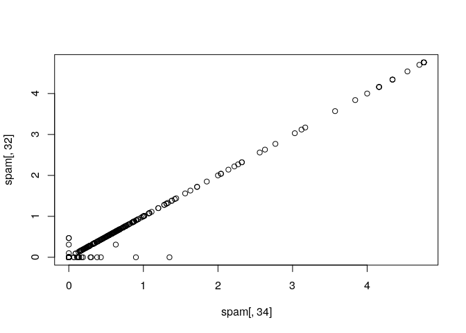
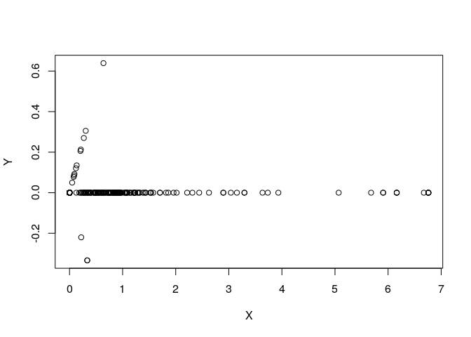
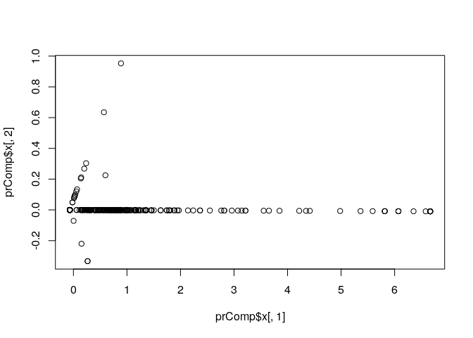
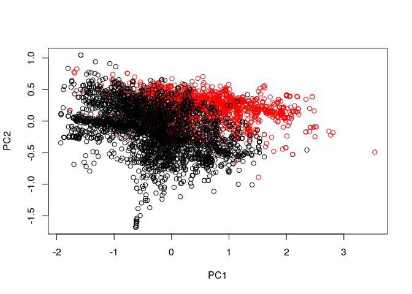
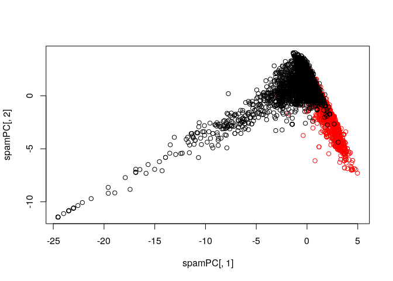

Preprocessing with PCA
================

## Setup

``` r
library(caret)
```

    ## Loading required package: lattice

    ## Loading required package: ggplot2

``` r
library(kernlab)
```

    ## 
    ## Attaching package: 'kernlab'

    ## The following object is masked from 'package:ggplot2':
    ## 
    ##     alpha

``` r
data(spam)
```

``` r
inTrain <- createDataPartition(y = spam$type, p = 0.75, list = FALSE)
training <- spam[inTrain,]
testing <- spam[-inTrain,]
```

## Correlated predictors

``` r
M <- abs(cor(training[, -58]))
diag(M) <- 0
which(M > 0.8, arr.ind = TRUE)
```

    ##        row col
    ## num415  34  32
    ## direct  40  32
    ## num857  32  34
    ## direct  40  34
    ## num857  32  40
    ## num415  34  40

``` r
names(spam)[c(34, 32)]
```

    ## [1] "num415" "num857"

``` r
plot(spam[,34], spam[,32])
```

<!-- -->

### Rotating the plot

``` r
X <- 0.71 * training$num415 + 0.71 * training$num857
Y <- 0.71 * training$num415 - 0.71 * training$num857

plot(X, Y)
```

<!-- -->

We can use the sum of these 2 variables to make 1 predictor

### SVD

\[ X = UDV^T \]

*U matrix*: left singular vector

*D matrix*: diagonal vector (singular values)

*V matrix*: right singular vector

### Principal Components

``` r
smallSpam <- spam[, c(34, 32)]
prComp <- prcomp(smallSpam)
plot(prComp$x[,1], prComp$x[,2])
```

<!-- -->

``` r
prComp$rotation
```

    ##              PC1        PC2
    ## num415 0.7080625  0.7061498
    ## num857 0.7061498 -0.7080625

### PCA on dataset

``` r
typeColor <- ((spam$type == "spam") * 1 + 1)
prComp <- prcomp(log10(spam[, -58] + 1))

plot(prComp$x[,1], prComp$x[,2], col = typeColor, xlab = "PC1", ylab = "PC2")
```

<!-- -->

### PCA using CARET

``` r
preProc <- preProcess(log10(spam[,-58] + 1), method = "pca", pcaComp = 2)
spamPC <- predict(preProc, log10(spam[, -58] + 1))

plot(spamPC[,1], spamPC[,2], col = typeColor)
```

<!-- -->

## Preprocessing with PCA - training

``` r
preProc <- preProcess(log10(spam[,-58] + 1), method = "pca", pcaComp = 2)
trainPC <- predict(preProc, log10(training[, -58] + 1))
modelFit <- train(type ~ ., method = "glm", preProcess = "pca", data = training)
```

## Preprocessing with PCA - testing

``` r
confusionMatrix(testing$type, predict(modelFit, testing))
```

    ## Confusion Matrix and Statistics
    ## 
    ##           Reference
    ## Prediction nonspam spam
    ##    nonspam     657   40
    ##    spam         39  414
    ##                                           
    ##                Accuracy : 0.9313          
    ##                  95% CI : (0.9151, 0.9452)
    ##     No Information Rate : 0.6052          
    ##     P-Value [Acc > NIR] : <2e-16          
    ##                                           
    ##                   Kappa : 0.8562          
    ##                                           
    ##  Mcnemar's Test P-Value : 1               
    ##                                           
    ##             Sensitivity : 0.9440          
    ##             Specificity : 0.9119          
    ##          Pos Pred Value : 0.9426          
    ##          Neg Pred Value : 0.9139          
    ##              Prevalence : 0.6052          
    ##          Detection Rate : 0.5713          
    ##    Detection Prevalence : 0.6061          
    ##       Balanced Accuracy : 0.9279          
    ##                                           
    ##        'Positive' Class : nonspam         
    ##
