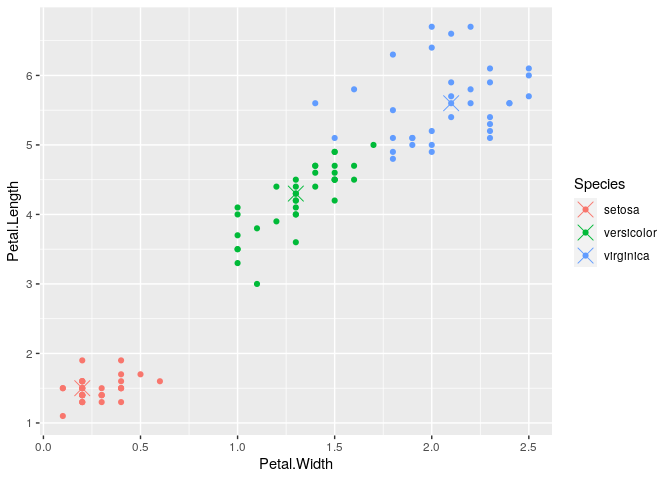
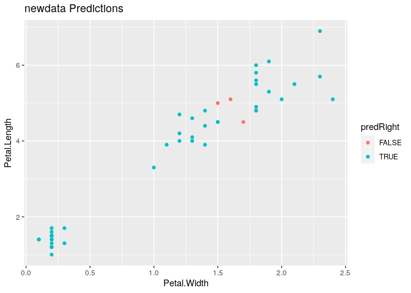

Random Forests
================

## Setup

``` r
data(iris)
library(ggplot2)
library(caret)
```

    ## Loading required package: lattice

``` r
library(randomForest)
```

    ## randomForest 4.6-14

    ## Type rfNews() to see new features/changes/bug fixes.

    ## 
    ## Attaching package: 'randomForest'

    ## The following object is masked from 'package:ggplot2':
    ## 
    ##     margin

## Subsets

``` r
inTrain <- createDataPartition(iris$Species, p = 0.7, list = FALSE)

training <- iris[inTrain,]
testing <- iris[-inTrain,]
```

## Random Forest

``` r
modFit <- train(Species ~ ., data = training, method = "rf", prox = TRUE)
modFit
```

    ## Random Forest 
    ## 
    ## 105 samples
    ##   4 predictor
    ##   3 classes: 'setosa', 'versicolor', 'virginica' 
    ## 
    ## No pre-processing
    ## Resampling: Bootstrapped (25 reps) 
    ## Summary of sample sizes: 105, 105, 105, 105, 105, 105, ... 
    ## Resampling results across tuning parameters:
    ## 
    ##   mtry  Accuracy   Kappa    
    ##   2     0.9700769  0.9544995
    ##   3     0.9734078  0.9595365
    ##   4     0.9690708  0.9529857
    ## 
    ## Accuracy was used to select the optimal model using the largest value.
    ## The final value used for the model was mtry = 3.

``` r
getTree(modFit$finalModel, k = 2)
```

    ##   left daughter right daughter split var split point status prediction
    ## 1             2              3         3        4.95      1          0
    ## 2             4              5         3        2.45      1          0
    ## 3             6              7         4        1.75      1          0
    ## 4             0              0         0        0.00     -1          1
    ## 5             0              0         0        0.00     -1          2
    ## 6             8              9         4        1.60      1          0
    ## 7             0              0         0        0.00     -1          3
    ## 8             0              0         0        0.00     -1          3
    ## 9             0              0         0        0.00     -1          2

## Center of Class Predictions

``` r
irisP <- classCenter(training[, c("Petal.Length", "Petal.Width")], label = training$Species, prox = modFit$finalModel$prox)
irisP <- as.data.frame(irisP)
irisP$Species <- rownames(irisP)
qplot(Petal.Width, Petal.Length, col = Species, data = training) + 
    geom_point(data = irisP, aes(Petal.Width, Petal.Length, col = Species), size = 5, shape = 4)
```

<!-- -->

## Predict New Values

``` r
pred <- predict(modFit, testing)
testing$predRight <- pred == testing$Species
table(pred, testing$Species)
```

    ##             
    ## pred         setosa versicolor virginica
    ##   setosa         15          0         0
    ##   versicolor      0         13         2
    ##   virginica       0          2        13

## Plot Prediction Accuracy

``` r
qplot(Petal.Width, Petal.Length, color = predRight, data = testing, main = "newdata Predictions")
```

<!-- -->
