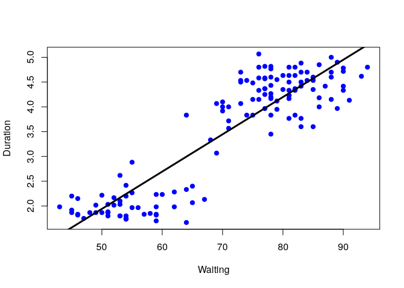
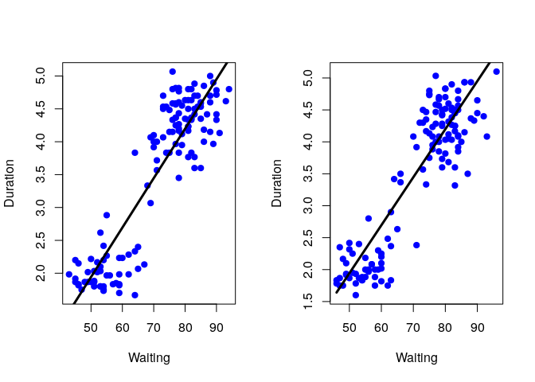
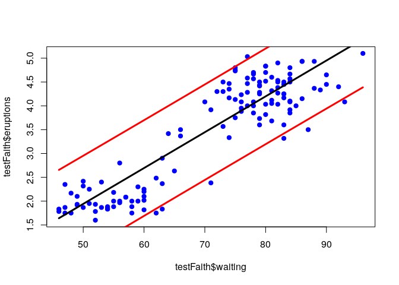

Predicting with Regression
================

## Setup

``` r
library(caret)
```

    ## Loading required package: lattice

    ## Loading required package: ggplot2

``` r
data("faithful")
```

## Separate Train and Test sets

``` r
inTrain <- createDataPartition(y = faithful$waiting, p = 0.5, list = FALSE)
trainFaith <- faithful[inTrain,]
testFaith <- faithful[-inTrain,]
head(trainFaith)
```

    ##   eruptions waiting
    ## 2     1.800      54
    ## 4     2.283      62
    ## 5     4.533      85
    ## 6     2.883      55
    ## 7     4.700      88
    ## 8     3.600      85

## EDA

``` r
plot(trainFaith$waiting, trainFaith$eruptions, pch = 19, col = "blue", xlab = "Waiting", ylab = "Duration")
```

<!-- -->

## Fit a Linear Model

``` r
lm1 <- lm(eruptions ~ waiting, data = trainFaith)
summary(lm1)$coef
```

    ##                Estimate  Std. Error   t value     Pr(>|t|)
    ## (Intercept) -1.81835963 0.225281595 -8.071497 3.384665e-13
    ## waiting      0.07521069 0.003119093 24.113000 8.986641e-51

``` r
with(trainFaith, plot(waiting, eruptions, pch = 19, col = "blue", xlab = "Waiting", ylab = "Duration"))
lines(trainFaith$waiting, lm1$fitted, lwd = 3)
```

<!-- -->

## Predict a New Value

Simulation of the prediction using lm coefficients

``` r
# Y = b0 + b1 * X
coef(lm1)[1] + coef(lm1)[2] * 80
```

    ## (Intercept) 
    ##    4.198496

Actual prediction value

``` r
newdata <- data.frame(waiting = 80)
predict(lm1, newdata)
```

    ##        1 
    ## 4.198496

## Plotting the prediction of training and test sets

``` r
par(mfrow = c(1, 2))
plotVals <- function(df){with(df, plot(waiting, eruptions, pch = 19, col = "blue", xlab = "Waiting", ylab = "Duration"))}
plotVals(trainFaith)
lines(trainFaith$waiting, predict(lm1), lwd = 3)
plotVals(testFaith)
lines(testFaith$waiting, predict(lm1, newdata = testFaith), lwd = 3)
```

<!-- -->

## Get training and test set Errors

### RMSE on Training

``` r
sqrt(sum((lm1$fitted - trainFaith$eruptions)^2))
```

    ## [1] 5.865756

### RMSE on Testing

``` r
sqrt(sum((predict(lm1, newdata = testFaith) - testFaith$eruptions)^2))
```

    ## [1] 5.687559

## Prediction Intervals

``` r
pred1 <- predict(lm1, newdata = testFaith, interval = "prediction")
ord <- order(testFaith$waiting)

plot(testFaith$waiting, testFaith$eruptions, pch = 19, col = "blue")
matlines(testFaith$waiting[ord], pred1[ord,], type = "l", col = c(1, 2, 2), lty = c(1, 1, 1), lwd = 3)
```

<!-- -->

## Fit model using CARET package

``` r
modFit <- train(eruptions ~ waiting, data = trainFaith, method = "lm")
summary(modFit$finalModel)$coef
```

    ##                Estimate  Std. Error   t value     Pr(>|t|)
    ## (Intercept) -1.81835963 0.225281595 -8.071497 3.384665e-13
    ## waiting      0.07521069 0.003119093 24.113000 8.986641e-51
