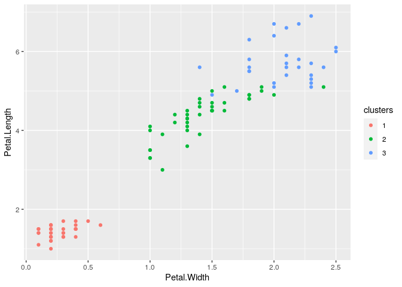

Unsupervised Prediction Simulation
================

To build a predictor:

  - Create clusters

  - Name the clusters

  - Build predictor for the clusters

In a new data set:

  - Predict clusters

## Setup

``` r
library(caret)
```

    ## Loading required package: lattice

    ## Loading required package: ggplot2

``` r
library(ggplot2)
data(iris)
```

## Subsets

``` r
inTrain <- createDataPartition(iris$Species, p = 0.7, list = FALSE)
training <- iris[inTrain,]
testing <- iris[-inTrain,]
dim(training)
```

    ## [1] 105   5

``` r
dim(testing)
```

    ## [1] 45  5

## Create K-Means Cluster Analysis

  - Ignoring the species labels in iris data

<!-- end list -->

``` r
set.seed(566516)
kMeans1 <- kmeans(subset(training, select = -c(Species)), centers = 3)
training$clusters <- as.factor(kMeans1$cluster)
qplot(Petal.Width, Petal.Length, color = clusters, data = training)
```

<!-- -->

## Compare to Real Labels

``` r
table(kMeans1$cluster, training$Species)
```

    ##    
    ##     setosa versicolor virginica
    ##   1     35          0         0
    ##   2      0         33         8
    ##   3      0          2        27

## Build a Predictor

``` r
modFit <- train(clusters ~ ., data = subset(training, select = -c(Species)), method = "rpart") # Classification Tree
table(predict(modFit, training), training$Species)
```

    ##    
    ##     setosa versicolor virginica
    ##   1     35          0         0
    ##   2      0         35        10
    ##   3      0          0        25

## Apply on Test dataset

``` r
testClusterPred <- predict(modFit, testing)
table(testClusterPred, testing$Species)
```

    ##                
    ## testClusterPred setosa versicolor virginica
    ##               1     15          0         0
    ##               2      0         15         6
    ##               3      0          0         9
